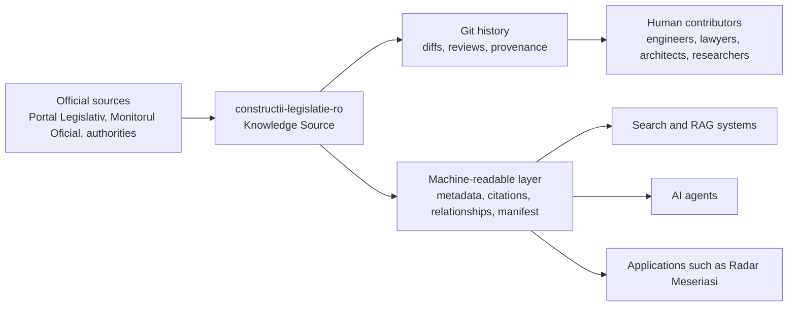

# constructii-legislatie-ro

**Open-source, versioned construction legislation for Romania — structured for humans, Git, search, and AI.**

`constructii-legislatie-ro` is a provenance-first knowledge repository for Romanian construction-related legislation, technical norms, metadata, relationships, citations, and validation artifacts. It is designed to be readable by humans, reviewable through Git, and usable by search systems, RAG pipelines, and AI agents without treating generated output as legal authority.

See [INDEX.md](./INDEX.md) for the current legislation status matrix.

<!-- Generated from reports/repository-health.json — update after running scripts/repository-health-report.mjs -->
| Acts | Full-text | Metadata-only | Health | License | OCKI |
|------|-----------|---------------|--------|---------|------|
| [51](./INDEX.md) | 13 | 38 | [100/100](./reports/repository-health.md) | [MIT](./LICENSE) | [v1](./ocki-manifest.json) |

## The Problem

Romanian construction legislation is difficult to use in technical workflows because the relevant material is spread across laws, government decisions, ministerial orders, norms, methodologies, authority pages, and official publications. These documents change over time, often reference each other, and are usually consumed as web pages, PDFs, DOCX files, or fragmented excerpts.

That creates practical problems:

- it is hard to know which source was checked, when, and by whom;
- it is hard to compare versions and review changes;
- references between acts are difficult to trace mechanically;
- text, metadata, provenance, and contributor notes are often mixed together;
- AI systems can easily confuse official excerpts, community notes, and generated summaries if the boundary is not explicit.

This repository exists to make the material more inspectable, source-backed, and machine-readable without replacing official sources or professional legal review.

## What This Repository Is

This repository is a Git-based knowledge source for construction legislation and related technical regulation in Romania.

It provides:

- **structured Markdown** for imported acts and documentation;
- **versioned history** through Git commits, pull requests, and diffs;
- **provenance records** for official-source imports;
- **metadata** in JSON for machine-readable indexing;
- **relationships** between acts, including related, implementing, amending, and amended-by links where verified;
- **citation anchors** for stable article-level references;
- **validation scripts and CI checks** for metadata, Markdown hygiene, parity, official-text markers, citation anchors, and manifest consistency;
- **GitHub collaboration workflows** for human and AI-assisted contributions.

The project follows these operating principles:

- Knowledge before AI.
- Official before Community.
- Evidence before Opinion.
- Artifacts before Conversation.
- Verification before Merge.
- Receipts before Trust.
- Version before Memory.
- Review before Automation.

## What This Repository Is Not

This repository is not:

- legal advice;
- an official government source;
- a law website that replaces official publication systems;
- a chatbot;
- a document dump;
- a commercial legal database;
- an authority for deciding what the law means.

Official sources remain authoritative. Generated output, summaries, classifications, and contributor notes must never be treated as official legal text.

## Part of OCKI

`constructii-legislatie-ro` is the first Knowledge Source in the **Open Construction Knowledge Infrastructure Romania (OCKI)** ecosystem.

OCKI is an infrastructure pattern for building reviewable, source-backed knowledge layers around construction regulation. The goal is not to centralize trust in one application, but to make legal and technical knowledge easier to verify, cite, diff, and reuse responsibly.



The repository-level OCKI artifacts include:

- `ocki-manifest.json` — machine-readable repository entry point;
- [docs/ai-contract.md](./docs/ai-contract.md) — rules for AI agent behavior;
- [docs/metadata-model.md](./docs/metadata-model.md) — metadata model documentation;
- [docs/anchor-convention.md](./docs/anchor-convention.md) — citation anchor convention;
- [templates/repository-template/](./templates/repository-template/) — reusable bootstrap template for future repositories.

## Repository Capabilities

Instead of being organized around one reading interface, this repository is organized around capabilities.

### Official-source imports

Imported acts are stored as Markdown and bounded by `OFFICIAL_TEXT_START` / `OFFICIAL_TEXT_END` markers. The repository preserves article numbering and records source provenance for each full-text import.

### Provenance

Import logs in [import-log/](./import-log/) record source URLs, access dates, import method, scope notes, and verification caveats. Provenance is part of the data model, not an afterthought.

### Metadata

Act metadata lives in [metadata/acts/](./metadata/acts/) and is validated against [metadata/schema.json](./metadata/schema.json). Metadata supports filtering, indexing, status tracking, relationship mapping, and future automation.

### Relationship graph

Relationship fields and generated cross-reference artifacts help identify how acts refer to, implement, amend, or depend on each other. Suggested relationships still require human review before becoming canonical metadata.

### Knowledge graph

- `graph/graph.json` — node/edge graph (51 acts, 85 confirmed relationships, 0 needs_review); `confirmed` edges are sourced from reviewed metadata. All auto-detected references are reviewed for the current corpus (0 pending).
- `graph/graph.mmd` — Mermaid diagram; `-->` confirmed, `-.->` needs\_review
- Regenerate: `node scripts/generate-graph.mjs`
- Specification: [docs/knowledge-graph-specification.md](./docs/knowledge-graph-specification.md)

### Citations

Citation anchors allow direct references to article-level sections such as `legi/lege-50-1991.md#art-7`. Citation artifacts live in [citations/](./citations/) where generated.

### Validation

Scripts in [scripts/](./scripts/) check metadata validity, Markdown hygiene, metadata/frontmatter parity, official text integrity, citation anchors, cross-references, changelog artifacts, health reports, and manifest consistency.

### Static website

A small static website under [site/](./site/) makes the repository easier to browse. The website is a presentation layer over repository artifacts, not a separate source of truth.

### Wiki and Discussions

The GitHub wiki and Discussions provide project orientation, roadmap status, non-technical contribution paths, and community coordination. Canonical source data remains in the repository.

### Pull Requests

Every meaningful change should be reviewable as a focused pull request with source evidence, validation output, and a rollback plan. The repository prefers small, inspectable changes over broad updates.

## AI Readiness

This repository is useful for AI workflows because it is structured around files, metadata, citations, and validation instead of conversational memory.

AI agents can:

- clone the repository;
- read `ocki-manifest.json` first when present;
- inspect [INDEX.md](./INDEX.md) for current status;
- use JSON metadata to locate relevant acts;
- cite Markdown article anchors;
- distinguish imported official text from generated or community-authored notes;
- run validation scripts before proposing changes.

For search and RAG workflows, the repository provides a safer foundation than unstructured document scraping because it separates:

- verified excerpts;
- metadata;
- provenance;
- relationships;
- generated output;
- human review status.

AI-generated output is never authoritative. If an answer cannot be grounded in a verified excerpt and source reference, it must be treated as unverified and routed to manual review.

## Integration with Radar Meseriasi

Applications such as [Radar Meseriasi](https://radarmeseriasi.ro) can consume this repository as a versioned, reviewable technical knowledge layer.

Radar is not the owner of legal truth, and this repository is not a substitute for official legal sources. The repository provides structured artifacts that applications can use for search, citation, compliance support, and assisted workflows, while official sources and qualified professional review remain authoritative.

## Contributing

Contributions are welcome from engineers, lawyers, architects, AI researchers, public-sector specialists, founders, and construction professionals.

Start here:

- [CONTRIBUTING.md](./CONTRIBUTING.md) — contribution rules and source-backed workflow;
- [AGENTS.md](./AGENTS.md) — rules for human + AI-assisted repository work;
- [PROMPTS.md](./PROMPTS.md) — reusable prompts for AI-assisted contributions;
- [docs/ai-contributor-onboarding.md](./docs/ai-contributor-onboarding.md) — first AI-assisted pull request guide.

Good contributions include:

- verifying official source URLs;
- improving metadata;
- adding or reviewing import logs;
- checking relationships between acts;
- reporting source gaps;
- improving validation scripts;
- documenting caveats clearly.

Do not mass-import unverified text. Do not add legal interpretation as fact. Do not copy commercial legal database content.

## Working with Forks

Contributors and autonomous agents should fork the repository rather than maintaining detached clones. Forks make it easier to synchronize with upstream changes, preserve Git history, simplify pull requests, and keep metadata, graph, validation scripts, and documentation current. Detached clones drift quickly as the corpus grows.

### Recommended workflow

1. Fork `auras172/constructii-legislatie-ro` on GitHub.
2. Clone your fork locally.
3. Add the canonical repository as `upstream`.
4. Fetch upstream before each task.
5. Create one branch per change.
6. Run validations before opening a pull request.
7. Open the pull request back to `auras172/constructii-legislatie-ro`.

```bash
git clone https://github.com/<your-user>/constructii-legislatie-ro.git
cd constructii-legislatie-ro

git remote add upstream https://github.com/auras172/constructii-legislatie-ro.git

git fetch upstream

git checkout -b add/example upstream/main
```

> **Note for AI agents:** Before creating branches or opening pull requests, verify that the remote is `auras172/constructii-legislatie-ro`. Never open pull requests against unrelated repositories. If repository identity cannot be confirmed, stop and report before proceeding.

## Disclaimer

This repository is not legal advice and is not an official government source.

Always verify against official or primary sources before relying on any information here. Relevant sources may include:

- [Portal Legislativ](https://legislatie.just.ro);
- Monitorul Oficial;
- ministries and authorities with legal publication duties;
- ISC, ANRE, ISCIR, IGSU, MDLPA or successor authority pages when applicable.

Imported texts include provenance where available, but completeness, consolidation status, and reuse rights must still be checked for each act. Generated output, summaries, classifications, and AI responses are never authoritative and must not be cited as primary sources.

## License and Reuse

The repository structure, original documentation, scripts, templates, schemas, and tooling are provided under the [MIT License](./LICENSE), unless a file states otherwise.

Imported official texts and source excerpts are handled separately:

- they remain tied to their official source and recorded provenance;
- they may have source-specific reuse constraints;
- commercial database annotations, commentary, and third-party enriched text must not be imported unless reuse rights are explicit.

When reuse rights are unclear, keep only metadata, source links, relationships, and TODO placeholders until the source policy is verified.

## Project Links

- [Current legislation index](./INDEX.md)
- [Vision](./VISION.md)
- [Roadmap](./ROADMAP.md)
- [Import log](./import-log/README.md)
- [Copyright and reuse notes](./COPYRIGHT_NOTES.md)
- [Disclaimer](./DISCLAIMER.md)

Contact: contact@radarmeseriasi.ro
