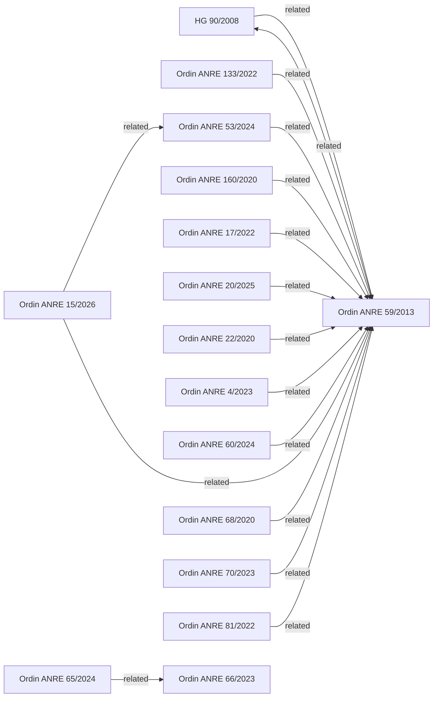
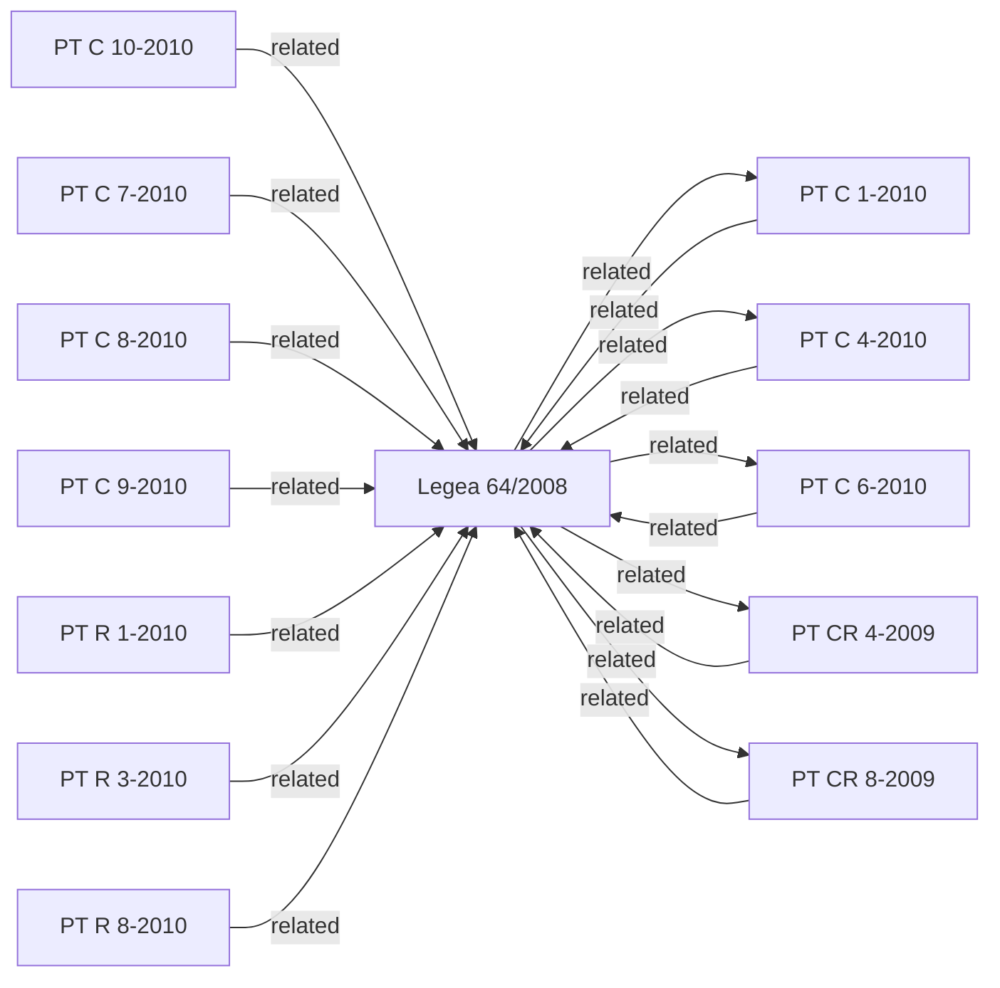
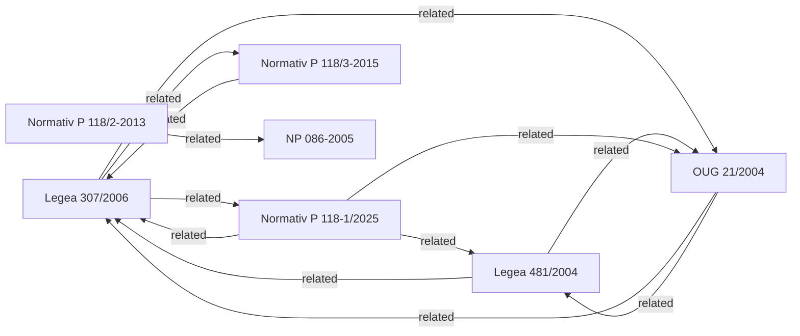
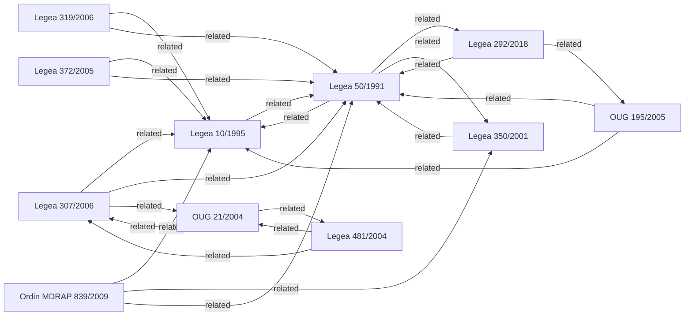

# OCKI Graph Overview

Verified from generated graph artifacts on 2026-07-15.

This page is a human-readable view over the existing repository graph. It does
not define legal relationships and does not replace the generated artifacts.

## Current Counts

Counts are read from the generated artifacts:

- `graph/graph.json`: 68 nodes, 107 confirmed edges, 0 auto-detected edges,
  0 unresolved skipped references.
- `reports/repository-health.json`: health 100/100, 68 metadata entries,
  13 full-text acts, 55 metadata-only acts.
- `ocki-manifest.json`: 68 acts total, 13 full-text acts, 55 metadata-only
  acts.

Canonical generated graph files:

- [graph/graph.json](../graph/graph.json)
- [graph/graph.mmd](../graph/graph.mmd)

For the full graph, open [graph/graph.mmd](../graph/graph.mmd) in a
Mermaid-compatible viewer. The embedded sections below are smaller slices
derived from confirmed edges in [graph/graph.json](../graph/graph.json).

## Edge Status

Confirmed edges come from reviewed metadata relationships. They are suitable
for graph traversal and documentation because they already exist in generated
graph data.

`needs_review` edges are suggestions that still require human review before
they become canonical metadata. The current generated graph reports 0
auto-detected edges and 0 unresolved skipped references.

The graph is provenance metadata, not legal advice. Official sources remain
authoritative. A missing edge does not mean that no legal relationship exists;
it means the repository has not recorded that relationship as confirmed graph
metadata.

## ANRE Subgraph

## ISCIR Subgraph

## Fire-Safety / P118 Subgraph

## Core Laws Subgraph

