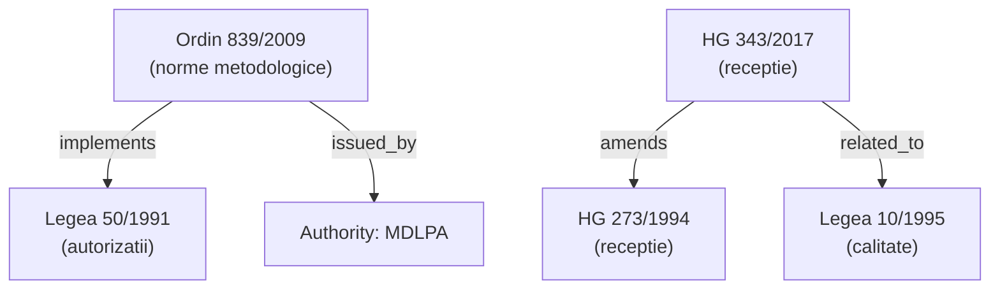

# OCKI Knowledge Graph Specification

**Status:** Draft
**Version:** 0.1
**Repository:** `constructii-legislatie-ro`
**Scope:** Applies to all OCKI repositories; cross-repo federation defined in §9.

---

## Table of Contents

1. [Purpose and Vision](#1-purpose-and-vision)
2. [Node Types](#2-node-types)
3. [Edge Types (Relationships)](#3-edge-types-relationships)
4. [Node Identifiers](#4-node-identifiers)
5. [Graph Serialization Format](#5-graph-serialization-format)
6. [Confidence Levels](#6-confidence-levels)
7. [Querying the Graph](#7-querying-the-graph)
8. [Graph Generation Pipeline](#8-graph-generation-pipeline)
9. [Multi-Repository Graph](#9-multi-repository-graph)
10. [Temporal Model](#10-temporal-model)
11. [Integration with RAG](#11-integration-with-rag)
12. [Implementation Roadmap](#12-implementation-roadmap)
13. [Graph Export Artifacts](#graph-export-artifacts)

---

## 1. Purpose and Vision

The OCKI Knowledge Graph (KG) is a machine-readable representation of the relationships between Romanian construction-law acts, their constituent articles, the authorities that issue and enforce them, and the subject domains they regulate.

Flat metadata files (`metadata/acts/*.json`) can answer "what is this act?" The KG answers questions that require traversing relationships across multiple acts and time periods.

### 1.1 Queries the KG Enables

**Multi-hop queries**

> "Find all acts that implement Legea 50/1991, and then all normatives that implement those acts."

Without the KG this requires manually chaining `implements` arrays across files. With the KG it is a single graph traversal:

```
MATCH path = (target:Act {slug:"lege-50-1991"})
             <-[:implements*1..3]-(n:Act)
RETURN n.slug, length(path)
```

**Temporal reasoning**

> "What was the legal framework for construction authorisation on 2020-01-01?"

A snapshot query filters all Act nodes to those where `effective_date ≤ 2020-01-01` and (`repeal_date IS NULL` OR `repeal_date > 2020-01-01`), then traverses `implements` and `requires` edges within that snapshot.

**Impact analysis**

> "If Legea 10/1995 is amended, which other acts are affected?"

Traverse outbound `implements`, `requires`, and `depends_on` edges from `lege-10-1995` to enumerate downstream acts. Traverse inbound `cites` edges from Article nodes to enumerate specific articles that reference provisions of Legea 10/1995.

**RAG grounding**

> "Cite the exact article from the exact act, not just the document."

Article nodes carry `line` offsets (from `citations/citation-index.json`) that map back to precise positions in the Markdown source files. A retrieval step can return `constructii-legislatie-ro:lege-50-1991#art-7` as a stable, dereferenceable citation rather than a blob of text from the whole act.

---

## 2. Node Types

### Notation

Properties marked **required** MUST be present on every node of that type. Properties marked *optional* MAY be omitted. The `id` field is always required and follows the scheme defined in §4.

---

### 2.1 `Act`

A legal act: a law (*lege*), government decision (*hotărâre*), ministerial order (*ordin*), ordinance (*ordonanță*), normative (*normativ*), guide (*ghid*), or procedure (*procedură*).

**Maps to:** `metadata/acts/*.json`

**Required properties**

| Property | Type | Description |
|---|---|---|
| `id` | string | Node identifier (§4) |
| `slug` | string | Repository-local slug, e.g. `lege-50-1991` |
| `title` | string | Full official title |
| `type` | enum | `lege \| hotarare \| ordin \| normativ \| ghid \| procedura \| ordonanta` |
| `domain` | string | Primary domain slug (e.g. `autorizatii`) |
| `status` | enum | `active \| repealed \| partially_repealed \| unknown` |
| `source_url` | string | Authoritative source URL |
| `last_checked` | date | ISO 8601 date of last verification |

**Optional properties**

| Property | Type | Description |
|---|---|---|
| `short_title` | string | e.g. `Legea 50/1991` |
| `canonical_citation` | string | e.g. `Legea nr. 50/1991` |
| `number` | string | Act number |
| `year` | string | Year of issue |
| `issuer` | string | Issuing body name |
| `issuing_body_kind` | enum | `parlament \| guvern \| minister \| autoritate \| other` |
| `effective_date` | date | When the act entered into force |
| `issue_date` | date | When the act was signed or adopted |
| `repeal_date` | date | When the act was repealed (if applicable) |
| `version_kind` | enum | `original \| republicat \| consolidat \| excerpt-only` |
| `consolidated_as_of` | date | Date of the consolidated form tracked |
| `article_count` | integer | Number of articles |
| `annex_count` | integer | Number of annexes |
| `topics` | string[] | Secondary classification topics |
| `tags` | string[] | Free-form tags |

**Example JSON**

```json
{
  "id": "constructii-legislatie-ro:lege-50-1991",
  "type": "Act",
  "properties": {
    "slug": "lege-50-1991",
    "title": "Legea nr. 50 din 29 iulie 1991 privind autorizarea executării lucrărilor de construcții",
    "short_title": "Legea 50/1991",
    "canonical_citation": "Legea nr. 50/1991",
    "type": "lege",
    "domain": "autorizatii",
    "status": "active",
    "effective_date": "1991-07-29",
    "version_kind": "consolidat",
    "consolidated_as_of": "2026-03-27",
    "article_count": 64,
    "annex_count": 3,
    "source_url": "https://legislatie.just.ro/Public/DetaliiDocument/1515",
    "last_checked": "2026-06-27"
  }
}
```

---

### 2.2 `Article`

A single numbered article (*articol*) within an Act. Article nodes are the primary unit for citation-level retrieval in RAG pipelines.

**Maps to:** `citations/citation-index.json` — each entry in `acts[slug].articles[]`

**Required properties**

| Property | Type | Description |
|---|---|---|
| `id` | string | Node identifier (§4), e.g. `constructii-legislatie-ro:lege-50-1991#art-7` |
| `act_id` | string | `id` of the parent Act node |
| `article_number` | string | Article number as string, e.g. `"7"` |
| `anchor` | string | Markdown anchor, e.g. `#art-7` |
| `file` | string | Relative path to Markdown source, e.g. `legi/lege-50-1991.md` |
| `line` | integer | 1-based line number in the source file |

**Optional properties**

| Property | Type | Description |
|---|---|---|
| `title` | string | Article heading if present |
| `text_excerpt` | string | First 200 characters of article text |
| `paragraph_count` | integer | Number of paragraphs (alineate) |

**Example JSON**

```json
{
  "id": "constructii-legislatie-ro:lege-50-1991#art-7",
  "type": "Article",
  "properties": {
    "act_id": "constructii-legislatie-ro:lege-50-1991",
    "article_number": "7",
    "anchor": "#art-7",
    "file": "legi/lege-50-1991.md",
    "line": 142
  }
}
```

---

### 2.3 `Paragraph`

A single numbered paragraph (*alineat*) within an Article. This is the finest-grained citable unit.

**Required properties**

| Property | Type | Description |
|---|---|---|
| `id` | string | e.g. `constructii-legislatie-ro:lege-50-1991#art-7-alin-2` |
| `article_id` | string | `id` of the parent Article node |
| `paragraph_number` | string | Paragraph number, e.g. `"2"` |
| `line` | integer | 1-based line number in the source file |

**Optional properties**

| Property | Type | Description |
|---|---|---|
| `text_excerpt` | string | First 200 characters of paragraph text |

**Note:** Paragraph nodes are generated only when source text is imported with sufficient structure to identify alineat boundaries. They are a Phase 2 feature.

---

### 2.4 `Annex`

An annex (*anexă*) attached to an Act.

**Required properties**

| Property | Type | Description |
|---|---|---|
| `id` | string | e.g. `constructii-legislatie-ro:hg-343-2017#anexa-1` |
| `act_id` | string | `id` of the parent Act node |
| `annex_number` | string | Annex number or label |
| `title` | string | Annex title |

**Optional properties**

| Property | Type | Description |
|---|---|---|
| `file` | string | Relative path to source if separately stored |
| `line` | integer | Start line in the source file |

---

### 2.5 `Authority`

An institutional body that issues or enforces acts. Authority nodes are shared across all OCKI repositories.

**Required properties**

| Property | Type | Description |
|---|---|---|
| `id` | string | e.g. `authority:mdlpa` |
| `slug` | string | e.g. `mdlpa` |
| `name` | string | Official Romanian name |

**Optional properties**

| Property | Type | Description |
|---|---|---|
| `acronym` | string | e.g. `MDLPA` |
| `kind` | enum | `minister \| inspectorat \| autoritate \| parlament \| guvern \| other` |
| `url` | string | Official website |
| `successor_of` | string | `id` of predecessor authority (if renamed/merged) |

**Example JSON**

```json
{
  "id": "authority:mdlpa",
  "type": "Authority",
  "properties": {
    "slug": "mdlpa",
    "name": "Ministerul Dezvoltării, Lucrărilor Publice și Administrației",
    "acronym": "MDLPA",
    "kind": "minister"
  }
}
```

**Known authorities (seed list)**

| `id` | Acronym | Notes |
|---|---|---|
| `authority:mdlpa` | MDLPA | Current ministry for construction |
| `authority:mdrap` | MDRAP | Predecessor of MDLPA |
| `authority:isc` | ISC | Inspectoratul de Stat în Construcții |
| `authority:igsu` | IGSU | Inspectoratul General pentru Situații de Urgență |
| `authority:isu` | ISU | Local fire inspectorates |
| `authority:anre` | ANRE | Autoritatea Națională de Reglementare în domeniul Energiei |
| `authority:iscir` | ISCIR | Inspecția de Stat pentru Controlul Cazanelor |
| `authority:parlament` | — | Parlamentul României |
| `authority:guvern` | — | Guvernul României |

---

### 2.6 `Domain`

A subject domain that groups related acts. Domains mirror the `domain` enum in `metadata/schema.json`.

**Required properties**

| Property | Type | Description |
|---|---|---|
| `id` | string | e.g. `domain:autorizatii` |
| `slug` | string | e.g. `autorizatii` |
| `label` | string | Human-readable label |

**Optional properties**

| Property | Type | Description |
|---|---|---|
| `description` | string | One-sentence description |
| `parent_domain` | string | `id` of a broader domain |

**Domain seed list**

| `id` | Label |
|---|---|
| `domain:autorizatii` | Autorizații de construire |
| `domain:urbanism` | Urbanism și amenajarea teritoriului |
| `domain:executie` | Executia lucrărilor de construcții |
| `domain:receptie` | Recepția lucrărilor |
| `domain:calitate` | Calitatea în construcții |
| `domain:isc` | Inspecție de stat în construcții |
| `domain:incendiu` | Securitate la incendiu |
| `domain:nzeb` | Eficiență energetică / nZEB |
| `domain:mediu` | Mediu și impact de mediu |
| `domain:munca` | Securitate și sănătate în muncă |

---

### 2.7 `Repository`

A meta-node representing an OCKI repository. Used for multi-repo federation (§9).

**Required properties**

| Property | Type | Description |
|---|---|---|
| `id` | string | e.g. `repo:constructii-legislatie-ro` |
| `slug` | string | GitHub repository name |
| `title` | string | Human-readable repository title |
| `url` | string | GitHub URL |

---

### 2.8 `Template` (future)

A form or template document derived from an Act or Article.

**Required properties:** `id`, `act_id`, `title`, `file`
**Status:** Planned. Not populated in Phase 1 or 2.

---

### 2.9 `Checklist` (future)

A compliance checklist derived from an Act.

**Required properties:** `id`, `act_id`, `title`
**Status:** Planned. Not populated in Phase 1 or 2.

---

### 2.10 `Workflow` (future)

A process derived from an Act (e.g. the authorisation workflow under Legea 50/1991).

**Required properties:** `id`, `act_id`, `title`
**Status:** Planned. Not populated in Phase 1 or 2.

---

## 3. Edge Types (Relationships)

Every edge has the following common fields:

| Field | Type | Description |
|---|---|---|
| `id` | string | Stable UUID or deterministic hash |
| `source` | string | Node `id` of the source |
| `target` | string | Node `id` of the target |
| `type` | string | Edge type identifier (snake_case) |
| `evidence` | string | Human-readable provenance note |
| `confidence` | enum | `confirmed \| suggested \| inferred` (§6) |
| `created_at` | date | ISO 8601 date this edge was recorded |

---

### 3.1 `implements`

**Source → Target:** `Act → Act`
**Cardinality:** many-to-many
**Meaning:** The source act provides the methodological norms, procedural rules, or secondary legislation that operationalises the target act.
**Maps to:** `metadata/schema.json` → `implements[]`
**Evidence required:** The source act's title or preamble explicitly states it implements the target.

**Example:** `ordin-839-2009 --implements--> lege-50-1991`

> Ordinul nr. 839/2009 "pentru aprobarea Normelor metodologice de aplicare a Legii nr. 50/1991"

---

### 3.2 `amends`

**Source → Target:** `Act → Act`
**Cardinality:** many-to-many
**Meaning:** The source act formally amends (modifies articles of) the target act.
**Maps to:** `metadata/schema.json` → `amends[]` / `amended_by[]`

**Example:** `hg-343-2017 --amends--> hg-273-1994`

---

### 3.3 `repeals`

**Source → Target:** `Act → Act`
**Cardinality:** many-to-one
**Meaning:** The source act formally abrogates the target act in its entirety.

**Example:** `lege-10-1995 (republicat 2015) --repeals--> lege-10-1995 (original 1995)` (within the amendment chain)

---

### 3.4 `supersedes`

**Source → Target:** `Act → Act`
**Cardinality:** many-to-one
**Meaning:** The source act replaces the target act in practice without a formal repeal clause being present in the text. Confidence is typically `suggested` or `inferred`.

---

### 3.5 `cites`

**Source → Target:** `Article → Article`
**Cardinality:** many-to-many
**Meaning:** The source article contains an explicit, textual cross-reference to the target article.
**Maps to:** `cross-references/relationships-auto.json` → `article_level_refs[]` (when populated)
**Evidence required:** Specific article reference text found in source, e.g. "conform art. 7 din Legea nr. 50/1991".

---

### 3.6 `references`

**Source → Target:** `Article → Act`
**Cardinality:** many-to-many
**Meaning:** The source article mentions the target act generically without citing a specific article.
**Maps to:** `cross-references/relationships-auto.json` → `references_in_text[]`

**Example:** `hg-343-2017#art-1 --references--> lege-10-1995`

---

### 3.7 `requires`

**Source → Target:** `Act → Act`
**Cardinality:** many-to-many
**Meaning:** The source act cannot be lawfully applied without the target act also being in force. Stronger than `depends_on`; typically backed by an explicit legal delegation clause.

**Example:** `ordin-839-2009 --requires--> lege-50-1991` (the Ordin has no independent existence without Legea 50)

---

### 3.8 `depends_on`

**Source → Target:** `Act → Act`
**Cardinality:** many-to-many
**Meaning:** The source act references or builds upon the target act, but can technically function independently. A soft dependency.

---

### 3.9 `derived_from`

**Source → Target:** `Template|Checklist|Workflow → Act`
**Cardinality:** many-to-one
**Meaning:** The source artefact was produced by synthesising or formalising rules from the target act.

---

### 3.10 `defined_by`

**Source → Target:** `Domain → Act`
**Cardinality:** many-to-many
**Meaning:** The target act is a primary definitional source for the domain.

**Example:** `domain:autorizatii --defined_by--> lege-50-1991`

---

### 3.11 `used_by`

**Source → Target:** `Act → Domain`
**Cardinality:** many-to-many
**Meaning:** The source act is used within (i.e., classified under) the target domain.

**Example:** `ordin-839-2009 --used_by--> domain:autorizatii`

---

### 3.12 `issued_by`

**Source → Target:** `Act → Authority`
**Cardinality:** many-to-one
**Meaning:** The source act was issued or signed by the target authority.

**Example:** `ordin-839-2009 --issued_by--> authority:mdrap`

---

### 3.13 `enforced_by`

**Source → Target:** `Act → Authority`
**Cardinality:** many-to-many
**Meaning:** The target authority is named as the enforcement body for the source act.

**Example:** `lege-50-1991 --enforced_by--> authority:isc`

---

### 3.14 `contains`

**Source → Target:** `Act → Article`, `Act → Annex`, `Article → Paragraph`
**Cardinality:** one-to-many
**Meaning:** Structural containment. Source structurally includes the target.
**Confidence:** Always `confirmed` — derived from the citation index and source structure.

---

### 3.15 `related_to`

**Source → Target:** `Act → Act`
**Cardinality:** many-to-many
**Meaning:** Catch-all weak relationship. The source and target share subject matter or are commonly cited together, but no stronger relationship can be confirmed.
**Maps to:** `metadata/schema.json` → `related_acts[]` for confirmed simple edges, or structured `relationships[]` when confidence/evidence annotation is needed.

> **Note:** `related_to` edges MUST NOT be used as proxies for `implements`, `amends`, or `requires`. Whenever a stronger relationship can be confirmed, the `related_to` edge SHOULD be replaced.

---

### 3.16 Edge Summary Table

| Edge | Source | Target | Strength | Metadata field |
|---|---|---|---|---|
| `implements` | Act | Act | Strong | `implements[]` |
| `amends` | Act | Act | Strong | `amends[]` / `amended_by[]` |
| `repeals` | Act | Act | Strong | — |
| `supersedes` | Act | Act | Medium | — |
| `cites` | Article | Article | Strong | `article_level_refs[]` |
| `references` | Article | Act | Medium | `references_in_text[]` |
| `requires` | Act | Act | Strong | — |
| `depends_on` | Act | Act | Weak | — |
| `derived_from` | Template/Checklist | Act | Strong | — |
| `defined_by` | Domain | Act | Medium | `domain` field |
| `used_by` | Act | Domain | Confirmed | `domain` field |
| `issued_by` | Act | Authority | Confirmed | `issuer` / `issuing_body_kind` |
| `enforced_by` | Act | Authority | Medium | — |
| `contains` | Act/Article | Article/Paragraph/Annex | Confirmed | citation-index |
| `related_to` | Act | Act | Weak | `related_acts[]` |

---

## 4. Node Identifiers

Every node MUST have a globally unique, stable, human-readable identifier. Node IDs MUST NOT change once published. If a slug must be corrected, the old ID is retired and a `same_as` alias is added to the new node.

### 4.1 Scheme

| Node type | Pattern | Example |
|---|---|---|
| `Act` | `{repo-slug}:{act-slug}` | `constructii-legislatie-ro:lege-50-1991` |
| `Article` | `{repo-slug}:{act-slug}#art-{N}` | `constructii-legislatie-ro:lege-50-1991#art-7` |
| `Paragraph` | `{repo-slug}:{act-slug}#art-{N}-alin-{M}` | `constructii-legislatie-ro:lege-50-1991#art-7-alin-2` |
| `Annex` | `{repo-slug}:{act-slug}#anexa-{N}` | `constructii-legislatie-ro:hg-343-2017#anexa-1` |
| `Authority` | `authority:{slug}` | `authority:mdlpa` |
| `Domain` | `domain:{slug}` | `domain:autorizatii` |
| `Repository` | `repo:{repo-slug}` | `repo:constructii-legislatie-ro` |
| `Template` | `{repo-slug}:{act-slug}#template-{slug}` | `constructii-legislatie-ro:lege-50-1991#template-cerere-ac` |
| `Checklist` | `{repo-slug}:{act-slug}#checklist-{slug}` | `constructii-legislatie-ro:lege-50-1991#checklist-autorizare` |

### 4.2 Rules

1. `{repo-slug}` MUST match the GitHub repository name exactly.
2. `{act-slug}` MUST match the filename stem of the act's JSON metadata file exactly (e.g. `lege-50-1991` for `metadata/acts/lege-50-1991.json`).
3. `{N}` in article/paragraph identifiers MUST match the `id` field in `citations/citation-index.json` (e.g. `art-7` not `article-7`).
4. Authority and Domain slugs are **global** — they MUST be identical across all OCKI repositories.
5. IDs are case-sensitive and MUST be lowercase.

---

## 5. Graph Serialization Format

### 5.1 `graph.json` — canonical machine-readable

All OCKI repositories MUST produce a `graph.json` file in the repository root (or `cross-references/graph.json`). The format is:

```json
{
  "version": "1.0",
  "repo": "constructii-legislatie-ro",
  "generated_at": "2026-06-28T18:00:00Z",
  "generator": "scripts/build-graph.js",
  "nodes": [
    {
      "id": "constructii-legislatie-ro:lege-50-1991",
      "type": "Act",
      "properties": {
        "slug": "lege-50-1991",
        "title": "Legea nr. 50 din 29 iulie 1991 privind autorizarea executării lucrărilor de construcții",
        "short_title": "Legea 50/1991",
        "type": "lege",
        "domain": "autorizatii",
        "status": "active",
        "effective_date": "1991-07-29",
        "article_count": 64,
        "source_url": "https://legislatie.just.ro/Public/DetaliiDocument/1515",
        "last_checked": "2026-06-27"
      }
    },
    {
      "id": "constructii-legislatie-ro:lege-50-1991#art-7",
      "type": "Article",
      "properties": {
        "act_id": "constructii-legislatie-ro:lege-50-1991",
        "article_number": "7",
        "anchor": "#art-7",
        "file": "legi/lege-50-1991.md",
        "line": 142
      }
    },
    {
      "id": "authority:mdlpa",
      "type": "Authority",
      "properties": {
        "slug": "mdlpa",
        "name": "Ministerul Dezvoltării, Lucrărilor Publice și Administrației",
        "acronym": "MDLPA",
        "kind": "minister"
      }
    },
    {
      "id": "domain:autorizatii",
      "type": "Domain",
      "properties": {
        "slug": "autorizatii",
        "label": "Autorizații de construire"
      }
    }
  ],
  "edges": [
    {
      "id": "e-ordin-839-2009-implements-lege-50-1991",
      "source": "constructii-legislatie-ro:ordin-839-2009",
      "target": "constructii-legislatie-ro:lege-50-1991",
      "type": "implements",
      "evidence": "Title: 'Norme metodologice de aplicare a Legii nr. 50/1991'; metadata/acts/ordin-839-2009.json#implements",
      "confidence": "confirmed",
      "created_at": "2026-06-28"
    },
    {
      "id": "e-hg-343-2017-amends-hg-273-1994",
      "source": "constructii-legislatie-ro:hg-343-2017",
      "target": "constructii-legislatie-ro:hg-273-1994",
      "type": "amends",
      "evidence": "Title: 'pentru modificarea Hotărârii Guvernului nr. 273/1994'; metadata/acts/hg-343-2017.json#amends",
      "confidence": "confirmed",
      "created_at": "2026-06-28"
    },
    {
      "id": "e-lege-50-1991-contains-art-7",
      "source": "constructii-legislatie-ro:lege-50-1991",
      "target": "constructii-legislatie-ro:lege-50-1991#art-7",
      "type": "contains",
      "evidence": "citations/citation-index.json",
      "confidence": "confirmed",
      "created_at": "2026-06-28"
    }
  ]
}
```

**Schema constraints:**

- `version` MUST be a semver-compatible string; currently `"1.0"`.
- `nodes[].id` MUST be unique within the file.
- `edges[].id` MUST be unique within the file. The RECOMMENDED format is `e-{source-slug}-{type}-{target-slug}`.
- `edges[].source` and `edges[].target` MUST refer to a node `id` that is either present in `nodes[]` of this file or resolvable via the multi-repo federation (§9).
- `edges[].confidence` MUST be one of `confirmed | suggested | inferred`.

### 5.2 `graph.mmd` — Mermaid diagram

A secondary, human-readable rendering for visualization in documentation:



The Mermaid file SHOULD be generated automatically from `graph.json`. It SHOULD include only Act-level nodes (omitting Article/Paragraph nodes) to remain legible.

---

## 6. Confidence Levels

Every structured metadata edge carries a `confidence` field. Auto-detected edges and simple-array edges expose their review state through `review_status` in the generated graph. Confidence MUST be one of three values when present:

| Value | Meaning | Human review required? |
|---|---|---|
| `confirmed` | The relationship is explicitly stated in the official text of the source act, in its preamble, its title, or in the repository metadata maintained by a human contributor. | No — may be used in production. |
| `suggested` | The relationship was auto-detected by a script (e.g. text-pattern matching in `cross-references/relationships-auto.json`). It has plausible evidence but has not been reviewed by a human contributor. | Yes — MUST NOT be presented to end users as authoritative without review. |
| `inferred` | The relationship was derived by transitive reasoning across two or more `confirmed` or `suggested` edges (e.g. "A implements B; B amends C; therefore A is downstream of C"). | Yes — MUST be marked explicitly as inferred in any citation. |

### Confidence Propagation Rules

1. An edge derived entirely from `confirmed` sources MUST be `confirmed`.
2. An edge derived from at least one `suggested` source MUST be at most `suggested`.
3. An edge derived by transitivity MUST be `inferred`, regardless of source confidence.
4. Confidence MAY only be upgraded (e.g. `suggested → confirmed`) by an explicit human review commit that updates a source-like evidence field with a verified source reference.
5. `confidence: "confirmed"` with `evidence_type: "inferred"` is invalid in current metadata validation.

---

## 7. Querying the Graph

The following patterns are expressed in a graph-query pseudo-code inspired by Cypher (Neo4j) and SPARQL. They are implementation-agnostic; the same patterns apply to an in-memory JSON traversal, a graph database, or a vector store with metadata filtering.

### 7.1 All acts that implement act X

```
MATCH (impl:Act)-[:implements]->(x:Act {slug: "lege-50-1991"})
RETURN impl.id, impl.short_title, impl.status
ORDER BY impl.effective_date ASC
```

**Current answer (confirmed edges only):** `ordin-839-2009`

### 7.2 Multi-hop: acts that implement X and their own implementors

```
MATCH path = (leaf:Act)-[:implements*1..3]->(x:Act {slug: "lege-50-1991"})
WHERE ALL(e IN relationships(path) WHERE e.confidence IN ["confirmed","suggested"])
RETURN leaf.id, length(path) AS hops
```

### 7.3 All articles that cite a given article

```
MATCH (src:Article)-[:cites]->(target:Article {id: "constructii-legislatie-ro:lege-50-1991#art-7"})
RETURN src.id, src.act_id
```

### 7.4 Acts active on a specific date

```
MATCH (a:Act)
WHERE a.properties.effective_date <= "2020-01-01"
  AND (a.properties.repeal_date IS NULL OR a.properties.repeal_date > "2020-01-01")
  AND a.properties.status IN ["active", "partially_repealed"]
RETURN a.id, a.properties.short_title
```

### 7.5 Impact analysis: downstream acts if X is amended

```
MATCH (x:Act {slug: "lege-10-1995"})
MATCH (downstream:Act)-[:implements|requires|depends_on]->(x)
RETURN downstream.id, downstream.properties.short_title
UNION
MATCH (art:Article)-[:cites]->(target:Article)
  WHERE target.properties.act_id = "constructii-legislatie-ro:lege-10-1995"
RETURN DISTINCT art.properties.act_id AS downstream_act
```

### 7.6 Shortest path between two acts

```
MATCH path = shortestPath(
  (a:Act {slug: "ordin-839-2009"})-[*..6]-(b:Act {slug: "lege-10-1995"})
)
RETURN [n IN nodes(path) | n.id] AS path_ids,
       [r IN relationships(path) | type(r)] AS edge_types
```

### 7.7 Full legal framework for a domain on a date

```
// Step 1: Domain node
MATCH (d:Domain {slug: "autorizatii"})

// Step 2: All acts used by this domain
MATCH (a:Act)-[:used_by]->(d)
WHERE a.properties.effective_date <= "2020-01-01"
  AND (a.properties.repeal_date IS NULL OR a.properties.repeal_date > "2020-01-01")

// Step 3: For each, expand implements/requires
MATCH (impl:Act)-[:implements|requires*0..2]->(a)
WHERE impl.properties.effective_date <= "2020-01-01"

RETURN DISTINCT impl.id, impl.properties.short_title
ORDER BY impl.properties.effective_date ASC
```

---

## 8. Graph Generation Pipeline

The pipeline runs in four stages. Each stage produces or updates `graph.json`.

### Stage 1 — Act nodes + confirmed edges from metadata (Phase 1)

**Input:** `metadata/acts/*.json`
**Output:** Act nodes plus graph-visible metadata edges implemented today.
**Confidence:** `confirmed`

```
FOR EACH file IN metadata/acts/*.json:
  1. Create Act node with id = "{repo}:{slug}"
  2. For each slug in related_acts[]:
       emit edge(relationship=related, source=act, target="{repo}:{slug}", review_status=confirmed)
  3. For each structured relationships[] record:
       emit edge(relationship=record.type, confidence=record.confidence,
                 review_status=confirmed when confidence=confirmed,
                 review_status=needs_review when confidence=suggested/inferred)
```

Current `scripts/generate-graph.mjs` does not emit simple `implements[]`,
`amends[]`, or `amended_by[]` arrays unless the same edge is also represented in
structured `relationships[]`.

### Stage 2 — Article nodes from citation-index (Phase 2)

**Input:** `citations/citation-index.json`
**Output:** Article nodes, `contains` edges
**Confidence:** `confirmed`

```
FOR EACH act IN citation-index.acts:
  FOR EACH article IN act.articles:
    1. Create Article node with id = "{repo}:{act-slug}#art-{N}"
    2. Set properties: line, anchor, file, act_id
    3. Emit contains edge: act → article, confidence=confirmed
```

### Stage 3 — Suggested edges from cross-references (Phase 3)

**Input:** `cross-references/relationships-auto.json`
**Output:** `references` edges (Article → Act), `cites` edges when article-level refs available
**Confidence:** `suggested`

```
FOR EACH act IN relationships-auto.suggested_relationships:
  FOR EACH ref IN references_in_text[]:
    emit edge(type=references, source="{repo}:{act}",
              target="{repo}:{ref}", confidence=suggested,
              evidence="cross-references/relationships-auto.json")
  FOR EACH ref IN article_level_refs[]:
    emit edge(type=cites, source=article-id, target=article-id,
              confidence=suggested)
```

### Stage 4 — Inferred edges via NLP (Phase 4, future)

**Input:** Act Markdown files
**Output:** Additional `cites`, `references`, `requires` edges
**Confidence:** `inferred`

A language model or NLP pipeline reads article text, identifies cross-references not captured by the regex-based Stage 3, and emits inferred edges. These MUST remain explicit review candidates: either outside confirmed metadata in generated review artifacts, or in structured `relationships[]` records with `confidence: "inferred"` so the graph marks them `needs_review`.

---

## 9. Multi-Repository Graph

### 9.1 Repository Scoping

Every node produced by a repository is namespaced with the `{repo-slug}` prefix. This prevents collisions when merging graphs from multiple OCKI repositories:

| Repository | Scope prefix |
|---|---|
| `constructii-legislatie-ro` | `constructii-legislatie-ro:` |
| `constructii-normative-ro` | `constructii-normative-ro:` |
| (future) `constructii-ghiduri-ro` | `constructii-ghiduri-ro:` |

`Authority` and `Domain` nodes are global and MUST NOT be prefixed with a repo slug. They are owned by a shared `ocki-shared-vocabulary` registry (future).

### 9.2 Merging into a Unified OCKI Graph

A federation script (`scripts/merge-graphs.js`, future) MUST:

1. Load each repository's `graph.json`.
2. Merge `nodes[]` arrays, deduplicating by `id`. If two repositories define the same node id with conflicting properties, the conflict MUST be logged and the one with the more recent `last_checked` date MUST win.
3. Merge `edges[]` arrays, deduplicating by `(source, target, type)`. If the same edge exists in two repositories with different `confidence` values, the higher confidence value wins.
4. Validate all `edges[].source` and `edges[].target` values resolve to a node in the merged graph.

### 9.3 Cross-Repository Edges

An act in one repository MAY `implement`, `amend`, or `cite` an act in another repository. Cross-repo edges are valid:

```json
{
  "id": "e-cross-normativ-p118-implements-lege-307-2006",
  "source": "constructii-normative-ro:normativ-p118-2-2015",
  "target": "constructii-legislatie-ro:lege-307-2006",
  "type": "implements",
  "confidence": "confirmed",
  "evidence": "Title of P118-2/2015 references Legea 307/2006"
}
```

Cross-repo edges MAY be stored in either repository or in a dedicated `ocki-graph-federation` repository (future).

### 9.4 Conflict Resolution

| Conflict | Resolution |
|---|---|
| Same node id, same properties | Deduplicate silently |
| Same node id, `last_checked` differs | Use the node with the more recent `last_checked` |
| Same node id, `status` differs | Flag for human review; keep both with a `conflict: true` marker |
| Same edge (source+target+type), different confidence | Promote to higher confidence |
| Same edge, different evidence | Concatenate evidence strings |

---

## 10. Temporal Model

### 10.1 Act Validity Period

Every Act node MAY carry:

- `effective_date` — the date the act entered into force (ISO 8601)
- `repeal_date` — the date the act was repealed or superseded (ISO 8601); NULL if currently active

An act is **active on date D** if and only if:

```
effective_date ≤ D AND (repeal_date IS NULL OR repeal_date > D)
```

### 10.2 Amendment Chains

When Act B amends Act A, Act A does not receive a new `effective_date`. Instead:

1. An `amends` edge is added: `B → A`.
2. A new Act node MAY be created for the consolidated form of A post-amendment, with a `consolidated_as_of` property and a `supersedes` edge pointing to the pre-amendment form.
3. The `version_kind` property distinguishes `original`, `republicat`, and `consolidat` forms.

**Example chain: Legea 10/1995**

```
lege-10-1995 (original, 1995)
  <--amends-- lege-177-2015 (republicat trigger)
lege-10-1995 (republicat 2015, effective 2015-09-11)
  --supersedes--> lege-10-1995 (original)
```

### 10.3 Snapshot Queries

To reconstruct the legal state on date D, a query engine MUST:

1. Filter Act nodes to those active on D (§10.1).
2. Filter edges to those where both `source` and `target` nodes are active on D.
3. Return only the result set from the filtered subgraph.

This is the basis for the temporal query pattern in §7.4.

### 10.4 Recording Repeal in Metadata

When an act is repealed, contributors MUST update:

1. `status` → `repealed` in `metadata/acts/{slug}.json`
2. `repeal_date` → ISO 8601 date in the Act node's properties in `graph.json`
3. The repealing act's metadata MUST include the repealed act slug in a `repeals[]` array (to be added to `metadata/schema.json`).

---

## 11. Integration with RAG

### 11.1 Overview

A RAG pipeline built on OCKI data SHOULD use the knowledge graph in three phases: pre-retrieval, retrieval, and post-retrieval.

### 11.2 Pre-Retrieval: Graph-Guided Candidate Selection

Before embedding-based retrieval, the graph narrows the candidate set:

1. **Domain filter:** map the user query to one or more `Domain` nodes (e.g. `domain:autorizatii`).
2. **Act filter:** collect all Act nodes reachable from the domain via `defined_by` or `used_by` edges.
3. **Temporal filter:** restrict to acts active on the relevant date (if a temporal context is given).
4. **Impact expansion:** if the query mentions a specific act, expand to all acts connected by `implements`, `requires`, or `amends` within 2 hops.

This produces a small candidate set of Act and Article nodes that is passed to the embedding retrieval step.

### 11.3 Retrieval: Article-Level Precision

Retrieval SHOULD be at the **Article** level, not the document level. Article nodes carry:

- `file` — the Markdown source file
- `line` — the exact start line in that file

A retrieval function can open `legi/{act-slug}.md`, seek to `line`, and return the article text with a stable citation:

```
Source: constructii-legislatie-ro:lege-50-1991#art-7
File: legi/lege-50-1991.md, line 142
```

### 11.4 Post-Retrieval: Related Context via Graph Edges

After retrieving the top-k articles, the pipeline MAY use graph edges to fetch related context:

- Follow `cites` edges to retrieve articles explicitly referenced by the retrieved article.
- Follow `implements` edges (upward) to retrieve the parent act that the retrieved act operationalises, providing higher-level normative context.
- Follow `requires` edges to check for prerequisite acts.

### 11.5 Citation Format

All citations in RAG output MUST use the stable node ID format:

```
[Legea nr. 50/1991, art. 7](constructii-legislatie-ro:lege-50-1991#art-7)
```

This format is:

- **Stable** — the ID does not change if the Markdown file is reorganised.
- **Dereferenceable** — a resolver can map `constructii-legislatie-ro:lege-50-1991#art-7` to the exact line in the repository.
- **Verifiable** — the citation can be checked against `citations/citation-index.json`.

### 11.6 Verified vs Generated Boundary

In accordance with the repository's `README.md` policy:

- Citations that point to a `confirmed`-confidence Article node and whose text matches the source file MUST be marked **Verified Excerpt**.
- Summaries or interpretations derived from article text MUST be marked **Generated Output**.
- No generated output MAY be presented as a Verified Excerpt.

---

## 12. Implementation Roadmap

### Phase 1 — Act Nodes + Confirmed Edges (current sprint)

**Goal:** Produce `cross-references/graph.json` with Act-level nodes and confirmed edges from existing metadata.

**Inputs:** `metadata/acts/*.json` (currently 20+ acts)
**Outputs:** `cross-references/graph.json`, `cross-references/graph.mmd`
**Script:** `scripts/build-graph.js` (to be created)

Deliverables:
- [ ] Act nodes for all acts in `metadata/acts/`
- [ ] `implements`, `amends`, `related_to`, `used_by`, `issued_by` edges from metadata fields
- [ ] Domain and Authority seed nodes
- [ ] `graph.json` schema validation script
- [ ] Mermaid diagram auto-generated from `graph.json`

### Phase 2 — Article Nodes from Citation Index

**Goal:** Add Article and Annex nodes using the existing `citations/citation-index.json`.

**Inputs:** `citations/citation-index.json`
**Outputs:** Article nodes appended to `graph.json`; `contains` edges

Deliverables:
- [ ] Article nodes for all indexed acts
- [ ] `contains` edges (Act → Article)
- [ ] RAG retrieval demo using graph + citation index

### Phase 3 — Suggested Edges from Cross-References

**Goal:** Promote auto-detected references in `cross-references/relationships-auto.json` to graph edges.

**Inputs:** `cross-references/relationships-auto.json`
**Outputs:** `references` and `cites` edges with `confidence: suggested`

Deliverables:
- [ ] `references` edges for all `references_in_text` entries
- [ ] `cites` edges for all `article_level_refs` entries (once populated)
- [ ] Human-review workflow: script to list all `suggested` edges pending review

### Phase 4 — Multi-Repository Graph Federation

**Goal:** Merge `graph.json` files from multiple OCKI repositories into a unified OCKI graph.

**Inputs:** `graph.json` from `constructii-legislatie-ro`, `constructii-normative-ro`, and future repos
**Outputs:** `ocki-graph.json` in a federation repository

Deliverables:
- [ ] Federation merge script
- [ ] Cross-repo edge support
- [ ] Conflict resolution log
- [ ] Unified Mermaid diagram across all repositories

---

## Graph Export Artifacts

The repository ships two generated graph files under `graph/`. These are the current, machine-consumable output of the graph generation pipeline.

### graph/graph.json

Machine-readable node/edge representation of the relationship graph. Generated by `node scripts/generate-graph.mjs`.

**Schema:**

- **nodes** — one entry per tracked act, with fields: `id` (slug), `label`, `type`, `domain`, `status`, `import_method`
- **edges** — relationships between acts, each with `source`, `target`, `relationship`, `review_status`, and `evidence`
  - `review_status: "confirmed"` — sourced from reviewed `related_acts` entries or structured `relationships[]` records with `confidence: "confirmed"`; safe for structural reasoning and navigation
  - `review_status: "needs_review"` — sourced from auto-detected text references in `cross-references/relationships-auto.json` or structured `relationships[]` records with `confidence: "suggested"` / `"inferred"`; navigational hints only, not canonical; do not assert legal relationships from these edges without verifying in official text
- **stats** — summary counts: `total_nodes`, `confirmed_edges`, `auto_detected_edges`, `unresolved_skipped`

Check `graph/graph.json` for current counts; this document intentionally does
not duplicate generated artifact counts.

**Deduplication rule:** if the same source→target pair appears in both sources, the `confirmed` edge is kept and the `needs_review` edge is dropped.

**Parsing example:**

```js
import { readFileSync } from 'fs';
const { nodes, edges, stats } = JSON.parse(readFileSync('graph/graph.json', 'utf8'));
const confirmed = edges.filter(e => e.review_status === 'confirmed');
```

### graph/graph.mmd

Mermaid diagram version of the same graph. Intended for human visualization in GitHub previews, documentation sites, or Mermaid-compatible tools.

Rendering convention:

- `-->` solid arrow — `confirmed` relationship (from reviewed metadata)
- `-.->` dashed arrow — `needs_review` (auto-detected, not yet human-verified)

### Regenerating the graph

After updating `metadata/acts/*.json` relationship fields or cross-reference data, regenerate both output files:

```sh
node scripts/generate-graph.mjs
```

The script is deterministic and idempotent: same input produces the same bytes. No timestamps are embedded in the output. Commit both `graph/graph.json` and `graph/graph.mmd` together after regeneration.

### AI agent guidance

- Use `confirmed` edges for structural navigation between acts (multi-hop traversal, dependency mapping).
- Do not assert legal relationships from `needs_review` edges without verifying in the official act text.
- The graph export is a navigational artifact, not a source of legal truth.
- Always cite the primary source (official text, Monitorul Oficial) rather than the graph edge.
- Read `ocki-manifest.json` first for a repository-level index before traversing the graph.

---

## Appendix A: Mapping Schema Fields to Graph Elements

| `metadata/schema.json` field | Graph element |
|---|---|
| `slug` (filename) | Act node `id` suffix |
| `title` | Act node `properties.title` |
| `type` | Act node `properties.type` |
| `domain` | `used_by` edge → Domain node; Act `properties.domain` |
| `status` | Act node `properties.status` |
| `effective_date` | Act node `properties.effective_date` (temporal model) |
| `issuer` + `issuing_body_kind` | `issued_by` edge → Authority node |
| `implements[]` | Confirmed simple metadata only; not currently emitted by `generate-graph.mjs` unless represented in structured `relationships[]` |
| `amends[]` | Confirmed simple metadata only; not currently emitted by `generate-graph.mjs` unless represented in structured `relationships[]` |
| `amended_by[]` | Confirmed simple metadata only; not currently emitted by `generate-graph.mjs` unless represented in structured `relationships[]` |
| `related_acts[]` | `related` edges (confirmed, weak) |
| `relationships[]` | Structured graph-visible edges with preserved `confidence`, `evidence_type`, and evidence fields |
| (not yet in schema) `repeals[]` | `repeals` edges — schema extension needed |

## Appendix B: RFC 2119 Key Words

The key words MUST, MUST NOT, REQUIRED, SHALL, SHALL NOT, SHOULD, SHOULD NOT, RECOMMENDED, MAY, and OPTIONAL in this document are to be interpreted as described in [RFC 2119](https://www.rfc-editor.org/rfc/rfc2119).

---

*This document is part of the OCKI project. It is MIT-licensed. It is a technical specification, not legal advice.*
